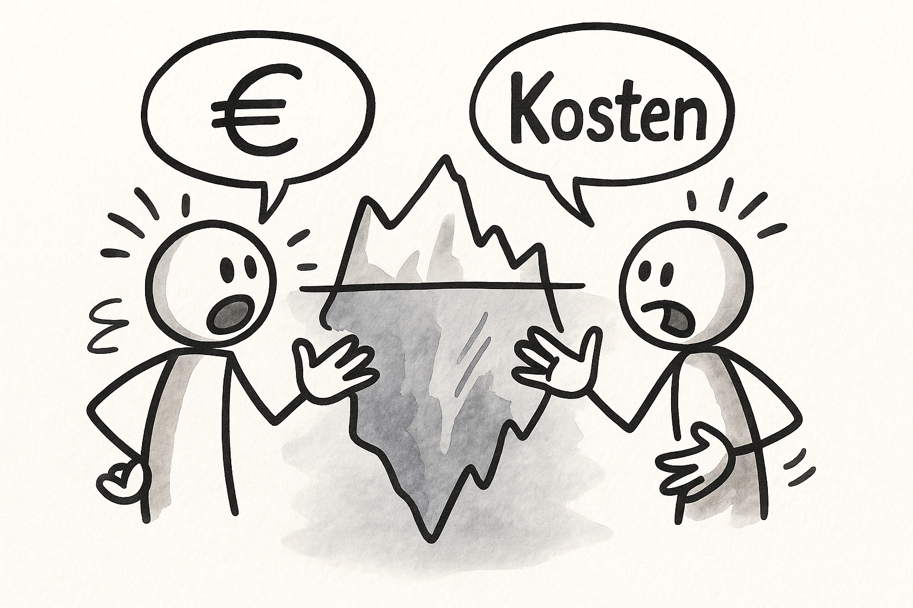

+++
categories = ['Blog']
tags = ['Mediation', 'Konfliktmanagement']
title = '7 unsichtbare Kosten von Konflikten – und warum sie Ihr Unternehmen teuer zu stehen kommen'

description = 'Versteckte Konfliktkosten in Unternehmen erkennen und senken – praxisnah erklärt mit Beispielen und Tipps für IT, Verwaltung und soziale Organisationen.'

summary = 'Versteckte Konfliktkosten in Unternehmen erkennen und senken – praxisnah erklärt mit Beispielen und Tipps für IT, Verwaltung und soziale Organisationen.'

keywords = ['Konfliktkosten', 'Konfliktmanagement', 'Mediation', 'Konfliktprävention', 'IT-Projekte', 'Konflikte in Organisationen', 'Eisbergmodell', 'Führungskräfte', 'Prozessberatung', 'versteckte Kosten']

date = 2025-04-30T09:01:14+02:00
slug = 'k-kosten'
read_more_copy = 'Mehr zu Konfliktkosten'
+++

## Warum Konflikte mehr kosten, als man denkt

Konflikte sind unvermeidlich — besonders in dynamischen Organisationen, IT-Projekten oder sozialen Einrichtungen. Was oft unterschätzt wird: Die eigentlichen Kosten eines Konflikts gehen weit über kurzfristige Reibungsverluste hinaus. Versteckte Konfliktkosten wirken langfristig und können erhebliche wirtschaftliche Auswirkungen haben.

Dieser Artikel zeigt Ihnen, welche Kostenfaktoren unter der Oberfläche schlummern und wie Sie durch professionelles Konfliktmanagement bares Geld sparen können.

## Das Eisbergmodell der Konfliktkosten

Das Eisbergmodell illustriert anschaulich: Nur ein kleiner Teil der Konfliktkosten ist sichtbar (z. B. Anwaltskosten, Abfindungen). Der weitaus größere Teil bleibt verborgen — Produktivitätsverluste, Mitarbeiterfluktuation und Innovationsbremsen verursachen enorme indirekte Kosten. ⛵️

## Die 7 größten versteckten Kosten von Konflikten

### 1. Produktivitätsverluste

Unbearbeitete Konflikte lenken Teams von ihrer eigentlichen Arbeit ab. Energie fließt in Streitigkeiten, Klärungen und politische Spielchen statt in Produktivität. Die Folge: Projekte verzögern sich, Leistungen sinken.

**Beispiel:** In IT-Projekten führen unklare Zuständigkeiten zu endlosen Abstimmungsschleifen.

### 2. Erhöhte Fluktuation

Mitarbeitende verlassen Unternehmen oft nicht wegen schlechter Bezahlung, sondern wegen ungelöster Konflikte. Jeder Mitarbeiterwechsel kostet — durch Rekrutierung, Einarbeitung und Know-how-Verlust.

**Beispiel:** In Pflegeeinrichtungen führen ungelöste Teamkonflikte zu einer gefährlichen Personalknappheit.

→ [Mediation bei Pflege und familiären Übergängen in Dresden]()

### 3. Innere Kündigung

Nicht alle kündigen nach außen. Manche kündigen innerlich: Sie erfüllen nur noch Mindestanforderungen, bringen keine Ideen mehr ein und identifizieren sich nicht mehr mit der Organisation. Das mindert Innovationskraft und Wettbewerbsfähigkeit.

**Beispiel:** Projektleitungen in Verwaltungen verlieren durch stille Resignation entscheidende Impulse für Change-Projekte.

### 4. Krankenstände

Dauerstress durch ungelöste Konflikte wirkt sich negativ auf die Gesundheit aus. Erhöhte Krankenstände bedeuten nicht nur Personalausfälle, sondern auch höhere Kosten für Krankengeld und Ersatzlösungen.

**Beispiel:** In multiprofessionellen Teams sozialer Einrichtungen steigt der Krankenstand oft sprunghaft an, wenn Konflikte nicht bearbeitet werden.

### 5. Reputationsschäden

Interne Konflikte bleiben selten intern. Unzufriedene Mitarbeitende, schlechte Stimmung und öffentliche Skandale schaden der Außenwirkung eines Unternehmens — und damit auch der Kundenbindung und dem Employer Branding.

**Beispiel:** IT-Dienstleister verlieren Aufträge, weil Kunden interne Unstimmigkeiten bemerken.

### 6. Innovationsverlust

Kreativität gedeiht nur in einem Klima von Vertrauen und Offenheit. Wo Konflikte überschattet werden oder Angst herrscht, gehen Innovationen zurück. Ideen bleiben unausgesprochen, Risiken werden gemieden.

**Beispiel:** Bei der Einführung neuer Tools in Organisationen versanden wichtige Vorschläge für Verbesserungen.

### 7. Versteckte Führungsaufwände

Führungskräfte investieren im Konfliktfall oft unbemerkt erhebliche Zeit und Energie in Konfliktmoderation, Einzelfalllösungen oder Krisengespräche. Diese "Schattenarbeit" fehlt an anderer Stelle — z. B. bei strategischer Steuerung oder Teamentwicklung.

**Beispiel:** Projektleiter in IT-Projekten können geplante Meilensteine nicht erreichen, weil sie mit Konfliktmanagement überlastet sind.

## Warum traditionelle Kostenrechnungen Konflikte unterschätzen

Klassische Controlling-Instrumente bilden Konfliktkosten selten adäquat ab. Fehlzeiten, Fluktuation oder sinkende Produktivität erscheinen oft erst verspätet oder gar nicht in den Bilanzen. Dadurch wird der wahre wirtschaftliche Schaden unterschätzt.

Organisationen, die Konfliktmanagementsysteme einrichten, erkennen früher Zusammenhänge und können gezielt gegensteuern. 🚀

## Praxisbeispiele: IT-Projekte und soziale Einrichtungen im Vergleich

- **IT-Projekte:** Unklare Anforderungen und Änderungen im Projektverlauf sind häufige Auslöser für Konflikte. Frühzeitige Moderation und klare Rollenklärungen helfen, Eskalationen zu vermeiden.

- **Soziale Einrichtungen:** Unterschiedliche Werte, hohe emotionale Belastungen und knappe Ressourcen bergen erhebliches Konfliktpotenzial. Regelmäßige Supervision und Konflikttrainings entlasten Teams nachhaltig.

## Fazit: Konfliktmanagement als Investition, nicht als Kostenfaktor

Konflikte kosten — viel mehr, als auf den ersten Blick sichtbar ist. Organisationen, die Konflikte frühzeitig erkennen und professionell bearbeiten, sparen nicht nur Geld, sondern stärken auch ihre Innovationskraft, ihr Employer Branding und die Zufriedenheit ihrer Teams. ✨

## Konfliktkosten erkennen und minimieren – mit Mediator Sweti

Möchten Sie Konflikte in Ihrer Organisation rechtzeitig erkennen, Konfliktkosten senken und Ihre Teams stärken?

Ich unterstütze Sie als **systemischer Mediator, Coach und Prozessberater** bei der Entwicklung individueller Lösungen — pragmatisch, vertraulich und zielorientiert.

➡️ **Jetzt kostenfreies Erstgespräch vereinbaren:** [Hier klicken](https://mediator.sweti.de/contact)

> *Gemeinsam machen wir Konfliktmanagement zu einem Erfolgsfaktor für Ihre Organisation.*

