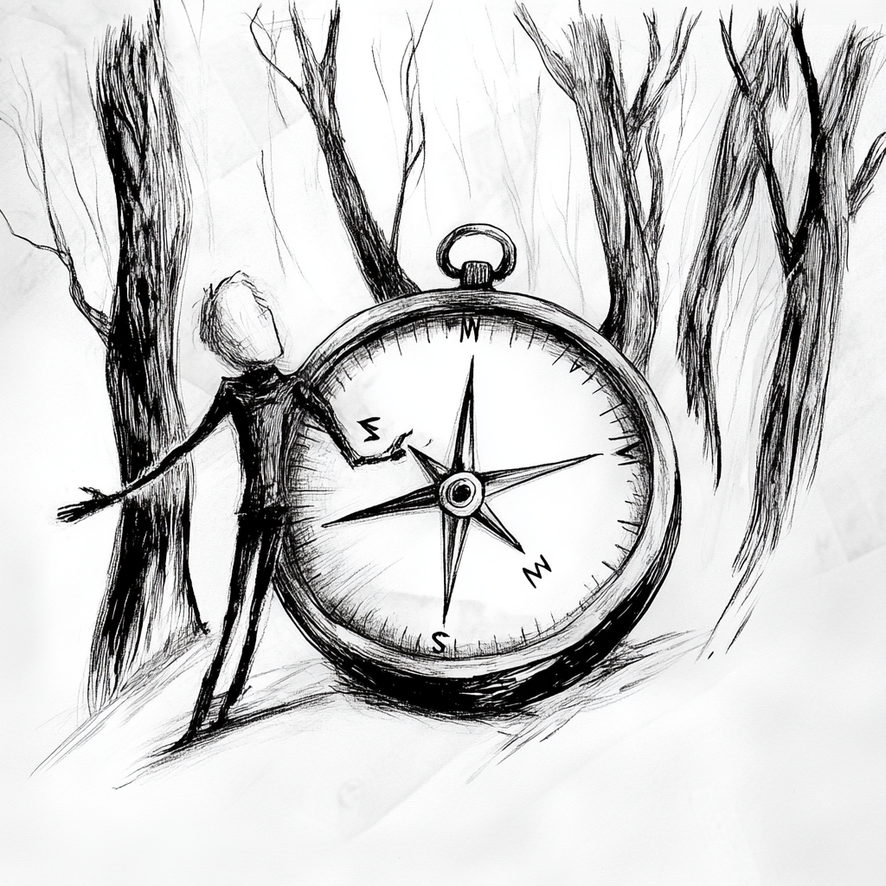

+++
categories = ['Blog', 'Medaition']
tags = ['Mediation', 'Konfliktmanagement', 'Dienstleistungen']
title = 'Konfliktcoaching: Dein persönlicher Kompass in stürmischen Zeiten'

description = 'Erfahre, wie Konfliktcoaching als persönlicher Kompass in stürmischen Zeiten hilft, Konfliktkompetenz zu stärken, Kommunikation zu verbessern und konstruktive Lösungen für berufliche und persönliche Herausforderungen zu entwickeln. Entdecke systemische Ansätze und praxisnahe Methoden.'
summary = "Konfliktcoaching ist ein individueller, systemischer Prozess zur Stärkung persönlicher Konfliktkompetenz – für Führungskräfte, Teams und Einzelpersonen. Im Unterschied zu Mediation und Konfliktberatung steht die Selbstreflexion des Coachees im Mittelpunkt: eigene Muster erkennen, Kommunikation verbessern, konstruktiv handeln."
keywords = ['Konfliktcoaching', 'Konfliktlösung', 'Konfliktkompetenz', 'systemische Beratung', 'Führungskräfteentwicklung', 'Konfliktmanagement', 'Selbstreflexion', 'Teamarbeit verbessern', 'Stressbewältigung', 'emotionale Intelligenz']
date = 2024-09-04T08:24:23+02:00

read_more_copy = 'Mehr über Konfliktcoaching'
slug = 'konfliktcoaching'
noindex = true
+++

Stell dir vor, du stehst in einem dichten Wald, umgeben von hohen Bäumen, und hast die Orientierung verloren. Du suchst verzweifelt nach einem Weg, doch jede Richtung scheint gleich zu sein. In diesem Moment wünscht du dir einen Kompass, der dir die richtige Richtung weist. **Konfliktcoaching** ist genau dieser Kompass in stürmischen Zeiten – es hilft dir, aus festgefahrenen Mustern herauszufinden, den eigenen Weg zu erkennen und Konflikte konstruktiv zu bewältigen.

## **Was versteht man unter Konfliktcoaching? – Eine Definition**

Konfliktcoaching ist ein individuell ausgerichteter, zielorientierter Prozess, der Menschen dabei unterstützt, ihre Konfliktkompetenz zu verbessern. Es geht darum, dem Coachee (die Person, die gecoacht wird) zu helfen, seine eigenen Reaktionsmuster und Denkschemata in Konfliktsituationen zu reflektieren und alternative, konstruktivere Verhaltensweisen zu entwickeln. Anders als bei der Konfliktberatung, die sich auf die systemische Analyse eines Konflikts im organisatorischen oder zwischenmenschlichen Kontext konzentriert, und der Mediation, die als Vermittlungsprozess zwischen Konfliktparteien dient, liegt der Fokus im Konfliktcoaching auf der individuellen Entwicklung des Coachees. Der Coach unterstützt den Coachee dabei, Konflikte als Chancen zur persönlichen und beruflichen Weiterentwicklung zu erkennen und diese gezielt zu nutzen.

## **Einsatzgebiete des Konfliktcoachings: Wann ist Konfliktcoaching sinnvoll?**

Konfliktcoaching ist besonders in Situationen sinnvoll, in denen es um die individuelle Entwicklung und das persönliche Wachstum im Umgang mit Konflikten geht. Hier sind einige konkrete Einsatzgebiete:

- **Führungskräfteentwicklung**: Führungskräfte, die lernen möchten, wie sie Konflikte in ihren Teams effektiver managen können, profitieren von Konfliktcoaching. Es stärkt ihre Rolle als Konfliktmoderatoren und hilft ihnen, konstruktive Lösungen zu fördern.
- **Persönliche Weiterentwicklung**: Einzelpersonen, die ihre Konfliktfähigkeit verbessern möchten, um besser mit Stress, Emotionen und schwierigen Gesprächen umzugehen, finden im Konfliktcoaching eine wertvolle Unterstützung.
- **Vorbereitung auf schwierige Gespräche oder Verhandlungen**: Konfliktcoaching bietet eine gezielte Vorbereitung auf herausfordernde Gespräche, wie z. B. Gehaltsverhandlungen oder Konfliktgespräche mit Kollegen und Vorgesetzten.
- **Wiederkehrende Konfliktmuster**: Für Menschen, die sich oft in ähnlichen Konfliktsituationen wiederfinden, hilft Konfliktcoaching, die zugrunde liegenden Muster zu erkennen und zu ändern.
- **Stressbewältigung und emotionale Intelligenz**: Es ist hilfreich für Personen, die ihre emotionale Reaktion auf Konflikte besser kontrollieren und ihre emotionale Intelligenz stärken möchten, um in angespannten Situationen ruhig und lösungsorientiert zu bleiben.

## **Wesentliche Aspekte des Konfliktcoachings**

Konfliktcoaching umfasst mehrere wesentliche Aspekte, die den Coaching-Prozess prägen und ihn von anderen Ansätzen unterscheiden:

1. **Individuelle Reflexion und Selbstwahrnehmung**: Ein zentraler Bestandteil des Konfliktcoachings ist die Förderung der Selbstreflexion. Der Coachee wird dazu angeregt, seine eigenen Verhaltensmuster, Denkschemata und emotionalen Reaktionen in Konfliktsituationen kritisch zu hinterfragen und neue Perspektiven zu entwickeln.

2. **Kompetenzentwicklung im Umgang mit Konflikten**: Das Coaching zielt darauf ab, die Fähigkeiten des Coachees im Umgang mit Konflikten zu verbessern. Dies umfasst die Entwicklung von Kommunikationsfähigkeiten, Verhandlungstechniken und der Fähigkeit, konstruktive Lösungen zu finden.

3. **Zielorientierter Ansatz**: Konfliktcoaching ist stark auf konkrete Ziele ausgerichtet. Es unterstützt den Coachee dabei, klare, umsetzbare Ziele für den Umgang mit Konflikten zu setzen und effektive Strategien zu entwickeln, um diese Ziele zu erreichen.

4. **Praxisorientierte Übungen und Feedback**: Der Coaching-Prozess beinhaltet praxisnahe Übungen wie Rollenspiele und Simulationen, die dem Coachee helfen, neue Fähigkeiten in einem sicheren Rahmen zu üben und zu verankern. Das Feedback des Coaches unterstützt die kontinuierliche Verbesserung.

5. **Förderung von Selbstverantwortung und Eigeninitiative**: Konfliktcoaching stärkt die Fähigkeit des Coachees, eigenverantwortlich und proaktiv Konflikte zu bewältigen. Der Coach hilft dem Coachee, eigene Ressourcen zu entdecken und selbstständig Lösungen zu entwickeln.

## **Wie verläuft ein Konfliktcoaching? – Settings, Erst- und Folge-Coaching**

Der Prozess des Konfliktcoachings ist klar strukturiert und folgt mehreren Phasen, die darauf abzielen, die Konfliktkompetenz des Coachees systematisch zu entwickeln und zu stärken.

**Settings im Konfliktcoaching: Einzelsetting**

Das Konfliktcoaching findet meist im **Einzelsetting** statt, was bedeutet, dass der Coach und der Coachee in einem vertraulichen, geschützten Rahmen zusammenarbeiten. Dieses Setting ermöglicht eine intensive, persönliche Arbeit und bietet Raum für individuelle Reflexion und gezielte Weiterentwicklung. Die Sitzungen können vor Ort in einem ruhigen Raum oder online über Videokonferenzen stattfinden und dauern in der Regel zwischen 60 und 90 Minuten.

**Erst-Coaching: Auftragsklärung und Zielsetzung**

Die erste Phase des Konfliktcoachings ist die **Erst-Coaching-Sitzung**, die der Auftragsklärung und Zielsetzung dient. Hierbei wird der Coaching-Rahmen festgelegt, und der Coachee formuliert seine spezifischen Anliegen und Ziele. Der Coach stellt gezielte Fragen, um die Erwartungen des Coachees zu klären und ein tiefes Verständnis für die Konfliktsituation zu entwickeln.

**Folge-Coaching: Konfliktanalyse, Entwicklung von Lösungsstrategien und Transfer in den Alltag**

Die **Folge-Coachings** bauen auf den Erkenntnissen aus dem Erst-Coaching auf und sind in mehrere Phasen unterteilt:

1. **Konfliktanalyse und Selbstreflexion**: Der Coachee reflektiert über seine eigenen Verhaltensmuster, Reaktionen und Emotionen in Konfliktsituationen. Der Coach verwendet systemische Methoden wie Fragetechniken und Visualisierungen, um tiefere Einsichten zu fördern.

2. **Entwicklung von Lösungsstrategien**: Basierend auf der Konfliktanalyse entwickelt der Coach gemeinsam mit dem Coachee alternative Handlungsmöglichkeiten und Strategien zur Konfliktbewältigung. Rollenspiele und Simulationen werden eingesetzt, um die neuen Ansätze in einem sicheren Rahmen zu erproben.

3. **Umsetzung und Transfer in den Alltag**: Der Coach unterstützt den Coachee dabei, die erarbeiteten Strategien in den Alltag zu integrieren und anzuwenden. Der Coachee wird ermutigt, seine Erfahrungen zu dokumentieren und regelmäßig über Erfolge sowie Herausforderungen zu reflektieren.

4. **Nachbereitung und Abschlussreflexion**: In der Abschlussphase reflektieren der Coach und der Coachee gemeinsam über den gesamten Coaching-Prozess, die erreichten Ziele und die gemachten Erfahrungen. Es wird besprochen, wie die neuen Fähigkeiten langfristig verankert werden können.

| **Merkmal**            | **Konfliktcoaching**                             | **Konfliktberatung**                               | **Mediation**                                     |
|------------------------|--------------------------------------------------|----------------------------------------------------|----------------------------------------------------|
| **Ziel**               | Individuelle Entwicklung und Reflexion           | Analyse und Lösung des gesamten Konfliktsystems    | Vermittlung zwischen Konfliktparteien              |
| **Fokus**              | Selbstreflexion und Kompetenzentwicklung         | Systemische Analyse und Bearbeitung von Konflikten | Kommunikation und Einigung der Konfliktparteien    |
| **Methoden**           | Coaching-Techniken, Rollenspiele, Feedback       | Systemische Fragetechniken, Aufstellungen          | Mediationsgespräche, Moderation                    |
| **Anwendung**          | Einzelpersonen, Führungskräfte                   | Teams, Organisationen, größere Gruppen             | Zwischenmenschliche Konflikte, Paare, kleine Gruppen|
| **Dauer**              | Langfristig, mehrere Sitzungen                   | Langfristig, mehrere Sitzungen                     | Kurzfristig, wenige Sitzungen
{class="UserTable"}                      |

## **Methoden im Konfliktcoaching: Der systemische Ansatz**

Das Konfliktcoaching setzt auf eine Vielzahl von Methoden, die flexibel an die Bedürfnisse des Coachees angepasst werden. Der **systemische Ansatz** ist dabei zentral, da er Konflikte nicht isoliert betrachtet, sondern immer im Kontext der Beziehungen und Wechselwirkungen, in denen sie entstehen.

- **Systemische Fragetechniken**: Diese helfen dem Coachee, neue Perspektiven zu gewinnen und festgefahrene Denk- und Verhaltensmuster zu erkennen und zu durchbrechen. Zirkuläre Fragen, hypothetische Fragen und Skalierungsfragen sind typische Beispiele.

- **Reframing**: Durch das Umdeuten von Konfliktsituationen oder Verhaltensweisen wird der Coachee ermutigt, Probleme in einem neuen Licht zu sehen und konstruktive Lösungen zu entwickeln.

- **Systemische Aufstellungen**: Diese Methode visualisiert die Beziehungen und Dynamiken im Konflikt und ermöglicht es dem Coachee, unbewusste Muster zu erkennen und neue Perspektiven zu entwickeln.

- **Reflecting Team**: Ein Team von Beobachtern gibt nach dem Coachinggespräch Reflexionen und Anregungen, die dem Coachee

 helfen, neue Einsichten und Perspektiven zu gewinnen.

- **Perspektivwechsel und Rollenwechsel**: Der Coachee wird ermutigt, die Perspektive anderer Konfliktparteien einzunehmen, um Empathie zu entwickeln und neue Verhaltensweisen zu erproben.

## **Fazit**

Konfliktcoaching ist ein kraftvoller Prozess, der darauf abzielt, die individuelle Konfliktkompetenz zu stärken und konstruktive Lösungen zu fördern. Durch den Einsatz systemischer Methoden und einen strukturierten Coaching-Prozess unterstützt Konfliktcoaching Menschen dabei, sich selbst besser zu verstehen, festgefahrene Muster zu durchbrechen und ihre Fähigkeit zur Konfliktbewältigung nachhaltig zu verbessern. Ob für Führungskräfte, Teams oder Einzelpersonen – Konfliktcoaching bietet maßgeschneiderte Unterstützung für alle, die ihre Konfliktkompetenz gezielt entwickeln möchten.
