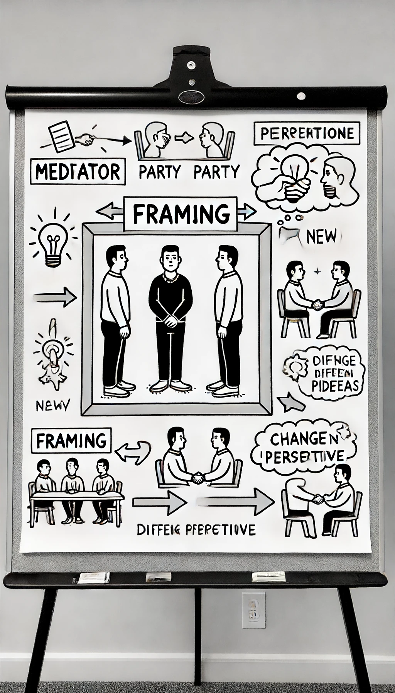
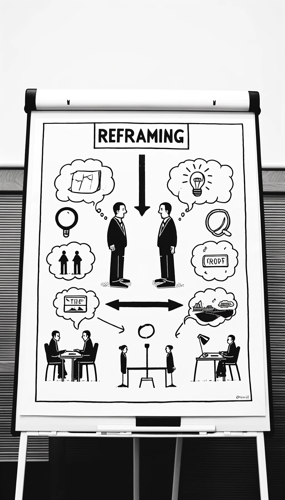

+++
categories = ['Blog']
tags = ['Mediation', 'Konfliktmanagement', 'Mediationstechniken', 'Interaktionen']
title = 'Framing und Reframing in der Mediation: Ein Weg zu neuen Perspektiven'
date = 2024-06-18T13:19:14+02:00
description = 'Framing und Reframing in der Mediation; Verständnissicherung, Perspektivenwechsel, Lösungssuche, Flexibilität, Kreativität'
slug = "reframing"
read_more_copy = "Mehr über der Reframing"

draft = false

noindex= true
[sitemap]
disable = true
+++

In der Welt der Mediation gibt es zwei mächtige Werkzeuge: _Framing und Reframing_. Diese Konzepte helfen dabei, wie wir Situationen sehen und verstehen. Framing bedeutet, bestimmte Aspekte einer Situation hervorzuheben, um deren Interpretation zu beeinflussen. Reframing hingegen zielt darauf ab, diese festen Deutungen zu verändern und neue Sichtweisen zu eröffnen. Diese Methoden sind besonders nützlich, um Konflikte konstruktiv zu lösen.

**Framing in der Mediation**

Framing kann in der Mediation bewusst oder unbewusst genutzt werden, um die Wahrnehmung und das Verhalten der Konfliktparteien zu beeinflussen.

**Bewusstes Framing:** Ein Mediator kann Framing verwenden, um positive Aspekte der Situation zu betonen, gemeinsame Interessen hervorzuheben und die Konfliktparteien zu einer Lösung zu führen. Dies geschieht durch wertschätzende Sprache, den Fokus auf Ressourcen und Kompetenzen sowie das Herausarbeiten gemeinsamer Ziele.

**Unbewusstes Framing:** Die eigene Sprache, Körpersprache und die Art der Fragen beeinflussen das Framing. Mediatoren müssen sich ihrer eigenen Annahmen und Werte bewusst sein und darauf achten, diese nicht unbewusst auf die Konfliktparteien zu übertragen.

**Vorteile des Framings in der Mediation**

* **Verständnissicherung:** Komplexe Themen können einfacher und verständlicher dargestellt werden.
* **Perspektivenwechsel:** Hilft den Konfliktparteien, die Situation aus verschiedenen Blickwinkeln zu sehen.
* **Lösungssuche:** Eröffnet neue Möglichkeiten und Kompromisse.

**Gefahren des Framings in der Mediation**

* **Manipulation:** Kann genutzt werden, um die Konfliktparteien zu manipulieren und eigene Interessen durchzusetzen.
* **Stereotypisierung:** Kann Vorurteile und Stereotype verstärken.
* **Verzerrung der Realität:** Kann zu einer verzerrten Wahrnehmung der Situation führen.

**Wie man Framing-Fallen vermeidet**

* **Neutralität:** Der Mediator sollte stets neutral bleiben und keine Partei bevorzugen.
* **Transparenz:** Eigene Annahmen und Werte offenlegen.
* **Reflektion:** Den Konfliktparteien Raum geben, ihre Sichtweisen zu äußern.

**Reframing: Den Blickwinkel verändern**

Reframing nimmt die bestehenden Deutungen und verändert sie, um neue Perspektiven zu eröffnen. Der Mediator kann verschiedene Techniken einsetzen, um die Konfliktparteien zu einem Perspektivenwechsel zu bewegen und die Situation neu zu bewerten.

**Drei Richtungen des Reframings**

1. **Kontext:** Die Bedeutung einer Situation kann durch das Verändern des Kontextes verändert werden. Zum Beispiel könnte ein Verhalten, das in einem bestimmten Kontext als negativ empfunden wird, in einem anderen Kontext als notwendig oder positiv betrachtet werden.

2. **Inhalt:** Hierbei wird der Inhalt der Situation neu interpretiert. Ein Konflikt, der als unlösbar erscheint, kann durch das Hervorheben von Gemeinsamkeiten und positiven Aspekten des Konflikts in einem neuen Licht erscheinen.

3. **Bedeutung:** Die tiefere Bedeutung oder der Sinn einer Situation kann neu bewertet werden. Dies kann den Parteien helfen, den Konflikt als eine Möglichkeit für persönliches Wachstum oder Verbesserung der Beziehung zu sehen, anstatt als bloße Auseinandersetzung.

**Vorteile des Reframings in der Mediation**

* **Flexibilität:** Hilft, starre Denkmuster zu durchbrechen und neue Lösungsmöglichkeiten zu finden.
* **Kreativität:** Fördert die Kreativität der Konfliktparteien und führt zu innovativen Lösungen.
* **Verständnis:** Trägt dazu bei, dass sich die Konfliktparteien besser verstehen.

**Fazit**

Framing und Reframing sind zentrale Werkzeuge in der Mediation, die zur Klärung der Kommunikation, zum Perspektivenwechsel und zur Lösungssuche beitragen können. Ein Mediator sollte sich der Macht dieser Techniken bewusst sein und sie verantwortungsvoll einsetzen, um festgefahrene Deutungen aufzubrechen und neue Perspektiven zu eröffnen.

Für Fragen oder weitere Informationen, wie diese Techniken in Ihrer spezifischen Situation helfen können, kontaktieren Sie uns gerne. Unser Team bei mediator.sweti.de steht Ihnen jederzeit zur Verfügung, um Sie bei der Lösung Ihrer Konflikte zu unterstützen.