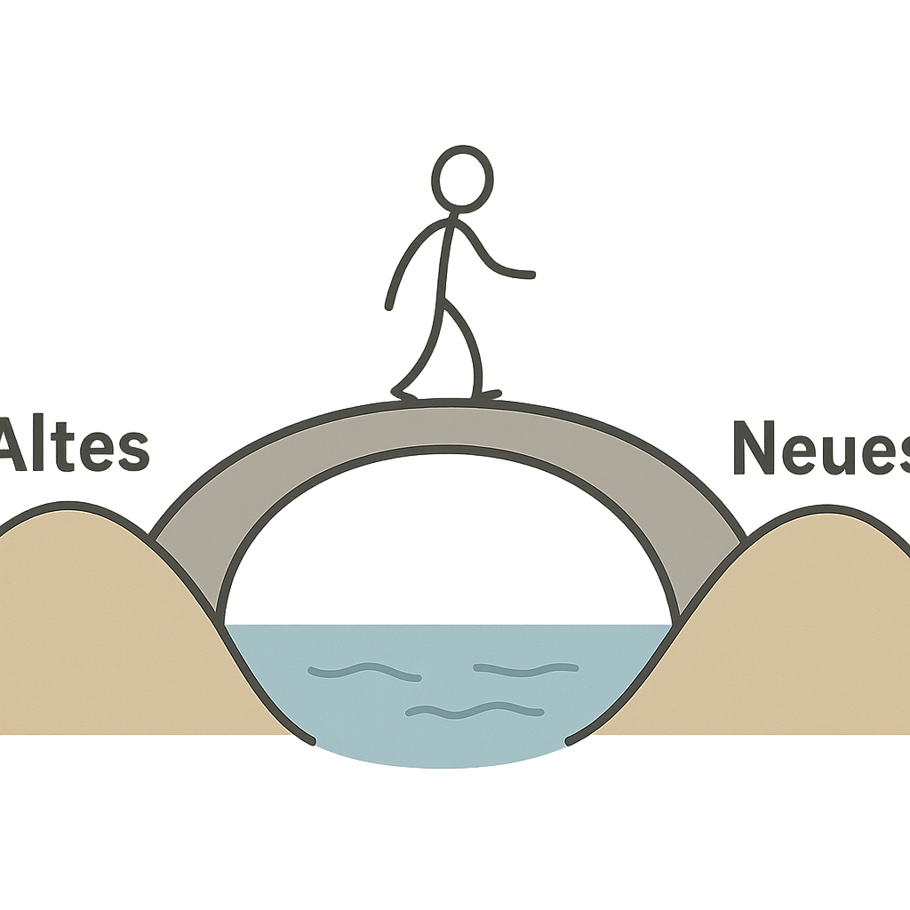





## Wenn der Kalender leer wird

Nach Jahrzehnten voller Aufgaben, Verantwortung und Routinen bricht plötzlich ein neuer Alltag an.  
Der letzte Arbeitstag ist vorbei, das Büro leer, die Schlüssel abgegeben.  
Erst fühlt es sich befreiend an – wie ein langer Urlaub. Doch dann, nach einigen Wochen, macht sich ein anderes Gefühl breit: Stille.  

Der Kalender, früher dicht gefüllt mit Terminen und Entscheidungen, bleibt leer.  
Und in dieser Leere tauchen neue Fragen auf:  
*„Wofür stehe ich morgens auf?“*  
*„Was bleibt, wenn die Arbeit wegfällt?“*  
*„Wer bin ich ohne meine Rolle?“*

Diese Phase, in der das Alte nicht mehr trägt und das Neue noch nicht vertraut ist, ist kein Scheitern.  
Es ist ein **Zwischenraum** – ein unscheinbarer, aber entscheidender Ort des Wandels.

---

## Zwischenräume als systemisches Prinzip

In der Sprache der **Systemtheorie** sind Übergänge keine Brüche, sondern Phasen der **Entkopplung und Neukopplung**.  
Ein System – ob Mensch, Beziehung oder Organisation – funktioniert über stabile Anschlusslogiken.  
Wenn diese Muster an Wirksamkeit verlieren, gerät das System in Bewegung.  

Niklas Luhmann beschreibt diesen Moment als den Punkt, an dem das System irritiert wird.  
Die gewohnten Routinen liefern keine verlässlichen Antworten mehr.  
Doch genau diese Irritation ist die Voraussetzung dafür, dass neue Muster entstehen können.  

Das Alte funktioniert nicht mehr, das Neue ist noch unsicher – dazwischen entsteht **Liminalität**.  
Der Begriff stammt aus der Anthropologie: *limen* bedeutet „Schwelle“.  
Arnold van Gennep und Victor Turner beschrieben damit die mittlere Phase jedes Übergangsrituals:  
den Zustand zwischen Trennung und Wiederankunft, zwischen Loslassen und Neuformierung.  

In diesen Schwellenräumen löst sich die gewohnte Ordnung auf.  
Man weiß nicht genau, wohin die Reise führt – aber man spürt, dass etwas in Bewegung ist.  
Zwischenräume sind keine leeren Phasen, sondern **produktive Unbestimmtheiten**.  
Hier entsteht Zukunft.

---

## Der Ruhestand als Schwellenraum

Der Übergang in den Ruhestand ist ein klassisches Beispiel für einen persönlichen Zwischenraum.  
Er bedeutet weit mehr als das Ende der Erwerbsarbeit.  
Er verändert Identität, Beziehungen, Tagesrhythmen und Selbstverständnis.  

Viele erleben zunächst Erleichterung: mehr Zeit, weniger Druck, kein Wecker.  
Doch nach einiger Zeit entsteht ein Gefühl der Leere.  
Die alte Struktur ist weg, die neue noch nicht gefunden.  

Diese Leere ist kein Defizit, sondern ein Signal:  
Das psychische System sucht nach einer neuen Form der Selbstbeschreibung.  
Bisher lautete sie vielleicht: *„Ich bin Ingenieurin, Lehrer, Führungskraft.“*  
Jetzt braucht es eine andere Antwort – nicht auf die Frage *„Was mache ich?“*, sondern *„Wer bin ich?“*  

In dieser Schwebephase wird sichtbar, was Bestand hat: Werte, Beziehungen, Neigungen, Interessen.  
Und erst aus dieser Offenheit heraus kann sich eine neue Lebensform entwickeln – freiwillig, eigen, selbstorganisiert.

---

## Zwischenräume im Coaching

Coaching begleitet genau solche Übergänge.  
Es bietet einen sicheren Rahmen, in dem Klient:innen ihre Routinen unterbrechen dürfen.  
Der Coach schafft **einen Zwischenraum im Zwischenraum** – ein Feld der Reflexion und des Experimentierens.  

In diesem Raum gilt kein Druck, sofort Lösungen zu finden.  
Es geht darum, Unsicherheit auszuhalten, bis neue Orientierung von innen entsteht.  

Systemisch betrachtet:  
- Der Coach **unterbricht** die automatische Selbstbeschreibung („Ich muss funktionieren“).  
- Er **hält** den Raum offen, ohne ihn vorschnell zu füllen.  
- Er **lädt** zur Beobachtung ein: *„Was will durch diese Lücke entstehen?“*  

Hier begegnen sich Theorie und Praxis:  
In der **Transaktionsanalyse** spricht man von *Umskriptung* – dem Moment, in dem das alte Drehbuch nicht mehr passt und ein neues geschrieben wird.  
Der Zwischenraum ist die Zeit, in der dieses neue Skript Gestalt annimmt.  

Er ist kein Ort des Wissens, sondern des Werdens.

---

## Zwischenräume in der Mediation

Auch in der Mediation spielen Zwischenräume eine zentrale Rolle.  
Wenn Konfliktparteien beginnen, miteinander zu sprechen, verlassen sie ihre vertrauten Positionen.  
Sie wissen noch nicht, ob sie sich verständigen können – aber sie beginnen, sich zu bewegen.  

Der Mediator schafft den Rahmen für diesen Prozess:  
- Er unterbricht alte Kommunikationsmuster.  
- Er sorgt für Sicherheit, damit Neues ausprobiert werden kann.  
- Er begleitet den Übergang von **Konfliktlogik zu Beziehungslogik**.  

In diesem Sinn ist die Mediation selbst ein **liminaler Prozess**:  
Sie öffnet einen Raum, in dem alte Vorwürfe ihre Kraft verlieren und neue Verständigung möglich wird.  

Hier spielt auch der **Ausgleichsgedanke** eine Rolle.  
Er wirkt wie eine Brücke zwischen Vergangenheit und Zukunft:  
Ausgleich bedeutet nicht Rückzahlung, sondern Wiederherstellung von Beziehungsgleichgewicht.  
In diesem Zwischenraum entsteht das, was man in der transformativen Mediation als „neue Beziehungserfahrung“ bezeichnet.

---

## Zwischenräume in Organisationen

Organisationen durchlaufen ähnliche Phasen.  
Nach einer Umstrukturierung, einem Führungswechsel oder einer neuen Strategie entsteht häufig eine „Phase der Schwebe“.  
Die neuen Prozesse sind definiert, aber noch nicht lebendig.  
Die alten Routinen wirken nach, verlieren aber an Sinn.  

Führungskräfte erleben diese Zeit oft als zäh oder unproduktiv – tatsächlich ist sie die produktivste.  
Denn Organisationen lernen nicht durch Pläne, sondern durch Kommunikation.  
Wenn die gewohnte Ordnung irritiert ist, beginnen Menschen, Sinn neu zu verhandeln.  

Systemisch gesprochen:  
Der Zwischenraum ist der Moment, in dem das System beginnt, **neue Anschlusslogiken zu entwickeln**.  
Hier entscheidet sich, ob Wandel gelingt oder in alte Muster zurückfällt.  

Führungskräfte, die diese Zwischenphasen aushalten können, wirken als „Hüter:innen des Übergangs“.  
Sie schaffen Strukturen, aber sie erzwingen keine Richtung.  
Sie halten Unsicherheit, bis das System selbst wieder in Resonanz kommt.

---

## Warum Zwischenräume unbequem – aber heilsam sind

Zwischenräume sind selten angenehm.  
Sie bringen Unsicherheit, Kontrollverlust, Ambiguität.  
Doch gerade diese Spannungen sind die Bedingung für Lernen und Entwicklung.  

In der Mediation, im Coaching und in der Organisation gilt:  
**Irritation ist der Beginn von Neuorganisation.**  

Wer Zwischenräume zu schnell schließt, riskiert Rückschritte.  
Wer sie offenhält, ermöglicht Wachstum.  
Das braucht Mut, Geduld und Vertrauen – in sich selbst, in andere und in die Selbstorganisationsfähigkeit von Systemen.  

Der Lohn ist nachhaltige Veränderung:  
nicht erzwungen, sondern entstanden.  
Nicht geplant, sondern gereift.



## Fazit: Wo Wandel wirklich passiert

Zwischenräume sind die unsichtbaren Werkstätten des Lebens.  
Hier reorganisieren sich Menschen, Teams und ganze Systeme.  
Hier geschieht das, was wir oft „Veränderung“ nennen, tatsächlich:  
Nicht auf dem Papier, sondern in der Kommunikation.  
Nicht in den Strukturen, sondern im Bewusstsein.  

Ob jemand in den Ruhestand geht, eine Beziehung neu definiert oder eine Organisation sich wandelt –  
entscheidend ist nicht, **was** sich verändert, sondern **wie** der Übergang gestaltet wird.  

Systemische Arbeit heißt, diesen Zwischenraum zu erkennen, zu öffnen und zu halten.  
Denn genau dort, im Schwebezustand zwischen Alt und Neu, zeigt sich das Lebendige.  

> „Zwischenräume sind keine Pausen – sie sind die eigentliche Bewegung des Wandels.“

---

## Einladung zum Austausch

Veränderung beginnt oft leise – mit einem Gefühl, dass etwas Altes endet und etwas Neues noch keinen Namen hat.  
Wenn Sie solche Übergänge erleben, begleite ich Sie gerne dabei, den Zwischenraum bewusst zu gestalten:  
mit Struktur, Haltung und Vertrauen in das, was wirkt.  

👉️ **Jetzt kostenfreies Orientierungsgespräch buchen**

